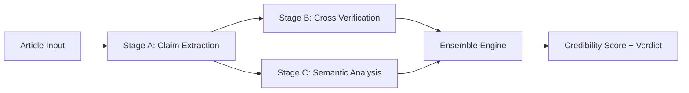

# Veritas — Fake News & Misinformation Detector
 Deployed link - https://fake-news-and-misinformation-detector-1.onrender.com
 
**An AI-powered, ensemble-based fake news detection system built with Flask.**
Every article is run through a three-stage AI pipeline — Claim Extraction → Cross Verification → Semantic Analysis — and scored by a transparent, formula-driven ensemble engine to produce a Credibility Score and a final verdict: **True**, **Suspect**, or **False**.


---

## Table of Contents

- [Overview](#overview)
- [Features](#features)
- [Demo / Screenshots](#demo--screenshots)
- [Architecture](#architecture)
- [Tech Stack](#tech-stack)
- [Getting Started](#getting-started)
- [Pipeline Engine Modes](#pipeline-engine-modes)
- [Dataset Format (Bulk Mode)](#dataset-format-bulk-mode)
- [Ensemble Scoring Formula](#ensemble-scoring-formula)
- [API Reference](#api-reference)
- [Project Structure](#project-structure)
- [Deployment](#deployment)
- [Roadmap](#roadmap)
- [Contributing](#contributing)
- [License](#license)

---

## Overview

Veritas has exactly **two modes** — no PDF/URL/DOCX ingestion, and no hardcoded sample data. Every analysis runs on data you provide.

| Mode | Description |
|------|-------------|
| **1. Single Article Detection** | Paste a title, body, source, and topic — get a full credibility dossier back instantly. |
| **2. Bulk Detection (CSV Upload)** | Upload a dataset of articles and get per-row verdicts plus accuracy/precision/recall/F1 metrics when ground-truth labels are provided. |

---

## Features

- **Three-stage AI pipeline** — claim extraction, cross-verification, and semantic/rhetorical analysis
- **Transparent ensemble engine** — a documented, reproducible scoring formula (not a black box)
- **Source authority tiering** — automatic classification into Tier 1 (gov/scientific/wire services), Tier 2 (mainstream media), Tier 3 (unverified/blogs)
- **Three interchangeable engines** — Offline rule-based (free, no key needed), NVIDIA (`openai/gpt-oss-20b`), or Anthropic Claude — with automatic fallback to offline if an API call fails
- **Bulk metrics** — accuracy, macro precision/recall/F1, and a full confusion matrix
- **CSV in, CSV out** — upload a dataset, download annotated results
- **Dark, dossier-themed dashboard** — animated pipeline tracker, credibility gauge, verdict stamp, collapsible claim cards

---

## Demo / Screenshots

> Add your own screenshots here once the app is running locally.

```
docs/screenshot-single.png   # Single Article dashboard: gauge + verdict stamp + claim cards
docs/screenshot-bulk.png     # Bulk Detection: results table + metrics + confusion matrix
```

---

## Architecture



**Stage A — Claim Extraction:** pulls 3–10 discrete, checkable factual claims from the article.
**Stage B — Cross Verification:** classifies each claim as `Corroborated`, `Contradicted`, or `No Tracked Records`.
**Stage C — Semantic Analysis:** flags bias, propaganda, logical fallacies, emotional manipulation, and context stripping across the article as a whole, plus a 1–5 consistency score.
**Ensemble Engine:** combines B + C into a per-claim score, averages across claims, and applies the source's authority multiplier to produce the final Credibility Score.

---

## Tech Stack

| Layer | Technology |
|-------|------------|
| Backend | Flask 3 (Blueprint architecture, REST API) |
| Frontend | Vanilla HTML / CSS / JS (no framework, no build step) |
| AI Engines | Offline heuristics · NVIDIA NIM (`openai/gpt-oss-20b`) · Anthropic Claude |
| Data | `csv` (stdlib) for bulk ingestion/export |
| Production server | Gunicorn |

---

## Getting Started

### Prerequisites
- Python 3.10+
- pip

### Installation

```bash
git clone https://github.com/YOUR_USERNAME/YOUR_REPO_NAME.git
cd YOUR_REPO_NAME
python3 -m venv venv
source venv/bin/activate        # Windows: venv\Scripts\activate
pip install -r requirements.txt
cp .env.example .env
```

### Run locally

```bash
python app.py
```

Visit **http://localhost:5000**.

### Run in production

```bash
gunicorn app:app
```

---

## Pipeline Engine Modes

Selected from the top bar in the UI (or via the `api_mode` field in API requests).

| Mode | Value | Requires a key? | Notes |
|------|-------|------------------|-------|
| Offline — Rule-Based | `offline` | No | Deterministic heuristics, runs with zero external calls. Default. |
| NVIDIA | `nvidia` | Yes | Uses `https://integrate.api.nvidia.com/v1`, model `openai/gpt-oss-20b` |
| Anthropic Claude | `claude` | Yes | Uses the Anthropic Messages API |

If an API call fails for any reason, the pipeline **automatically falls back to Offline mode** — a request never hard-fails.

Keys can be entered directly in the UI per-request, or set as server-side defaults in `.env`:

```env
NVIDIA_API_KEY=your-key-here
ANTHROPIC_API_KEY=your-key-here
```

Keys are never persisted to disk beyond the request lifecycle.

---

## Dataset Format (Bulk Mode)

Required CSV columns:

```
article_id,title,text,source,topic,ground_truth
```

- `ground_truth` is **optional**. When present it must be `True`, `Suspect`, or `False` (case-insensitive; `Fake`/`Real`/`0`/`1` are also normalized).
- A ready-to-use example is included at `uploads/sample_dataset.csv`.

**Example row:**

```csv
A001,NASA Confirms Water Ice Deposits Near Lunar South Pole,"According to NASA...",NASA,Science,True
```

**Output CSV columns:**

```
article_id, title, topic, source, credibility_score, ensemble_vote,
claim_count, model_disagreement, ground_truth, match
```

---

## Ensemble Scoring Formula

**Per-claim score:**

```
S_c = (W × 0.7) + (L / 5 × 0.3)

W → Corroborated = 1.0 | No Tracked Records = 0.5 | Contradicted = 0
L → Consistency Score (1–5) from Stage C
```

**Final credibility score:**

```
CS_A = mean(S_c) × AuthorityMultiplier × 100
```

**Authority multipliers:**

| Tier | Multiplier | Examples |
|------|:----------:|----------|
| 1 | 1.00 | Government, Reuters, NASA, WHO, Nature, Universities |
| 2 | 0.85 | Recognized mainstream media (CNN, BBC, NYT, etc.) |
| 3 | 0.50 | Unknown blogs, conspiracy websites |

**Verdict thresholds:**

| Score Range | Verdict |
|:-----------:|:-------:|
| 70 – 100 | True |
| 40 – 69 | Suspect |
| 0 – 39 | False |

Model Disagreement is the population standard deviation of the per-claim scores (Low / Medium / High) — a measure of how much individual claims disagree once corroboration is factored in.

---

## API Reference

### `POST /api/single/analyze`

```json
{
  "title": "string",
  "text": "string",
  "source": "string",
  "topic": "string",
  "api_mode": "offline | nvidia | claude",
  "api_key": "string (required unless offline)"
}
```

### `POST /api/bulk/analyze` (multipart/form-data)

| Field | Type | Description |
|-------|------|-------------|
| `file` | file | CSV dataset |
| `api_mode` | string | `offline` \| `nvidia` \| `claude` |
| `api_key` | string | Required unless offline |

### `GET /api/bulk/download/<filename>`

Downloads the generated results CSV for a completed bulk run.

### `GET /api/health`

Basic health check.

---

## Project Structure

```
FakeNewsDetector/
├── app.py                  # Flask entry point
├── config.py                # App configuration
├── requirements.txt
├── Procfile                 # For Render/Heroku/Railway
├── render.yaml               # One-click Render deploy config
├── .env.example
├── uploads/
│   └── sample_dataset.csv
├── blueprints/
│   ├── single.py             # Mode 1 REST endpoint
│   └── bulk.py                # Mode 2 REST endpoints
├── modules/
│   ├── claim_extractor.py     # Stage A
│   ├── corroboration.py        # Stage B
│   ├── semantic_analysis.py     # Stage C
│   ├── ensemble_engine.py        # Scoring + voting
│   ├── dataset_runner.py          # Bulk pipeline + metrics
│   └── utils.py
├── templates/
│   └── index.html
└── static/
    ├── css/style.css
    └── js/app.js
```

---

## Deployment

This repo is preconfigured for one-click deployment:

**Render.com**
1. Connect your GitHub repo at [render.com](https://render.com).
2. Render auto-detects `render.yaml` and sets the build/start commands.
3. Add `NVIDIA_API_KEY` / `ANTHROPIC_API_KEY` as environment variables (optional).
4. Deploy — auto-redeploys on every push to `main`.

**Railway.app**
1. New Project → Deploy from GitHub repo.
2. Railway auto-detects the `Procfile` (`gunicorn app:app`).

**Any other WSGI host** (PythonAnywhere, Fly.io, etc.) — use `gunicorn app:app` as the start command.

---

## Roadmap

- [ ] Optional persistent storage for bulk run history
- [ ] Pluggable real-world fact-checking API integrations for Stage B
- [ ] Batch export to PDF report
- [ ] User accounts / saved cases

---

## Contributing

Contributions are welcome. Please open an issue to discuss significant changes before submitting a pull request.

1. Fork the repo
2. Create a feature branch: `git checkout -b feature/my-feature`
3. Commit your changes: `git commit -m "Add my feature"`
4. Push and open a PR

---

## License

Distributed under the MIT License. See `LICENSE` for details.
